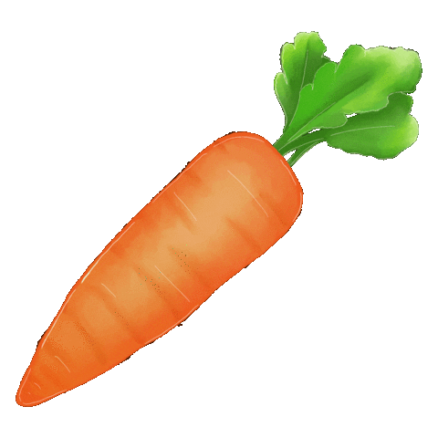

[index.html](https://github.com/user-attachments/files/22480142/index.html)
<!DOCTYPE html>
<html lang="en">
    <head>
        <title>My First HTML document</title>
    </head>
    <body>
       <h1 style="color:green">Why Carrot?</h1> 
       
Carrots are very nice friends that help us be healthy. These little assistants deserve some love!

       <h2 style="color:coral"> Carrot Merch to Buy</h2>
       <ul>
        <li>Great and nutritious, <a href="https://www.instacart.ca/products/16346052-carrot-bunch-each?retailerSlug=freshco-ca"> straight to your home!</a></li>
        <li>If you want some fluff, <a href="https://www.petlou.com/products/12-luxe-carrot-1">go for this!</a></li>
        <li>For carrot overload, <a href="http://petlou.com/products/33-luxe-carrot-1">choose this!</a></li>
    </ul>
        <h2 style="color:coral">Why do we love carrots?</h2>
        <ol>
            <li>helpful buddy</li>
            <li>smells great</li>
            <li>very bright colors</li>
        </ol>
     
       
      
    
       <h1 style="color:green">Shaking Carrot</h1>
            
The carrot (Daucus carota subsp. sativus) is a root vegetable, typically orange in colour, though heirloom variants including purple, black, red, white, and yellow cultivars exist, all of which are domesticated forms of the wild carrot, Daucus carota, native to Europe and Southwestern Asia. The plant probably originated in Iran and was originally cultivated for its leaves and seeds.

       

        <h2 style="color:green">Sign up for our fanpage!</h2>

<form action="https://en.wikipedia.org/wiki/Carrot">
  <label for="fname">First name:</label> 
  <input type="text" id="fname" name="fname" value="Carrot"> 
  <label for="lname">Last name:</label> 
  <input type="text" id="lname" name="lname" value="Fan">  
  <input type="submit" value="Submit">
</form> 

If you click the "Submit" button, you will be sent to learn more about carrots.

       

    </body>
</html>
